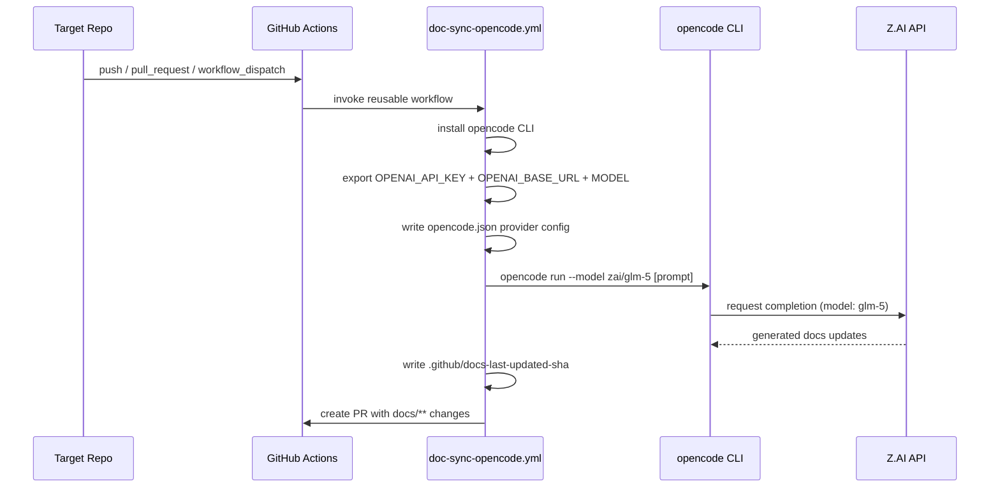

# API and Interface Reference

## Reusable Workflow: `doc-sync-opencode.yml`

The hub exposes `.github/workflows/doc-sync-opencode.yml` as both `workflow_dispatch` and `workflow_call` entrypoints for caller repositories.

### Inputs

| Input | Type | Required | Default | Description |
|-------|------|----------|---------|-------------|
| `install_script` | string | No | `""` | Custom opencode install commands |
| `run_script` | string | No | `""` | Custom run commands (uses prompt default if empty) |
| `endpoint` | string | Yes | `https://api.z.ai/api/coding/paas/v4` | OpenAI-compatible base URL |
| `model` | string | Yes | `glm-5` | Model identifier |
| `branch` | string | No | `docs/opencode-sync` | PR branch name |
| `pr_title` | string | No | `docs: automated sync — opencode harness` | PR title |
| `pr_body` | string | No | `Automated doc sync using Opencode harness` | PR body |

### Secrets Required

| Secret | Purpose |
|--------|---------|
| `OPENCODE_API_KEY` | Z.AI / OpenAI-compatible API key |
| `GH_AW_AGENT_TOKEN` | GitHub PAT used to commit doc updates and create PRs |

### Permissions Required

| Permission | Scope |
|------------|-------|
| `contents: write` | Commit doc updates and SHA file |
| `pull-requests: write` | Create PR with changes |
| `actions: read` | Read workflow context |

## Workflow Execution Sequence



## Error Codes and Exit Codes

| Exit Code | Condition | Remediation |
|-----------|-----------|-------------|
| 0 | Success | N/A |
| 1 | General error or authentication failure | Rotate `OPENCODE_API_KEY` secret |
| 1 | opencode not found after install | Check install script, verify PATH |
| 1 | Prompt fetch failed | Verify hub repo accessibility, check GITHUB_TOKEN |
| 1 | All install methods failed | Verify network access, try custom `install_script` |

### Authentication Error Detection

The workflow detects these authentication error patterns in opencode output:

| Pattern | Description |
|---------|-------------|
| `Error: token expired` | API key has expired |
| `Error: model not found` | Invalid model or unauthorized |
| `Error: unauthorized` | Invalid or missing API key |
| `ProviderModelNotFoundError` | Model not available with current credentials |

## `bootstrap.sh` CLI

### Usage

```bash
./scripts/bootstrap.sh          # dry run (list repos, no changes)
./scripts/bootstrap.sh --deploy # open PRs in all repos
```

### Options

| Flag | Description |
|------|-------------|
| (none) | Dry run mode - prints what would be done |
| `--deploy` | Execute deployment - opens PRs in target repos |

### Environment Variables

| Variable | Required | Description |
|----------|----------|-------------|
| `GH_TOKEN` | Yes | GitHub CLI authentication (set via `gh auth login`) |

### Exit Codes

| Code | Condition |
|------|-----------|
| 0 | Success (all repos processed) |
| 1 | GitHub CLI not authenticated |
| 1 | API error fetching repo list |

## Caller Workflow Interface

Spoke repositories use this minimal caller:

```yaml
name: doc-sync
on:
  push:
    branches: [main, master]
  pull_request:
    types: [opened, synchronize, reopened]
    branches: [main, master]
  workflow_dispatch:

jobs:
  doc-sync:
    uses: DefaceRoot/agentic-documentation/.github/workflows/doc-sync-opencode.yml@main
    secrets: inherit
```

### Customization

To override defaults, pass inputs:

```yaml
jobs:
  doc-sync:
    uses: DefaceRoot/agentic-documentation/.github/workflows/doc-sync-opencode.yml@main
    with:
      model: glm-5
      branch: docs/custom-sync
      pr_title: "docs: custom sync title"
    secrets: inherit
```

## Versioning and Deprecation

- The hub workflow is versioned via git refs (e.g., `@main`, `@v1.0.0`).
- Spoke repos pin to `@main` by default for automatic updates.
- Breaking changes to workflow inputs will be communicated via release notes.
- Deprecated inputs will be supported for at least one major version before removal.
