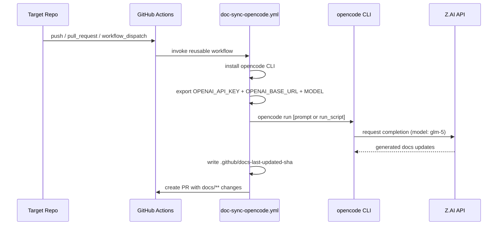

# API and Interface Reference

## Reusable Workflow: `doc-sync-opencode.yml`

The hub exposes `.github/workflows/doc-sync-opencode.yml` as both `workflow_dispatch` and `workflow_call` entrypoints for caller repositories.

### Inputs

| Input | Type | Required | Default | Description |
|-------|------|----------|---------|-------------|
| `install_script` | string | No | `""` | Custom opencode install commands |
| `run_script` | string | No | `""` | Custom run commands (uses prompt default if empty) |
| `endpoint` | string | Yes | `https://api.z.ai/api/coding/paas/v4` | OpenAI-compatible base URL |
| `model` | string | Yes | `glm-5` | Model identifier |
| `branch` | string | No | `docs/opencode-sync` | PR branch name |
| `pr_title` | string | No | `docs: automated sync — opencode harness` | PR title |
| `pr_body` | string | No | `Automated doc sync using Opencode harness` | PR body |

### Secrets Required

| Secret | Purpose |
|--------|---------|
| `OPENCODE_API_KEY` | Z.AI / OpenAI-compatible API key |
| `GH_AW_AGENT_TOKEN` | GitHub PAT used to commit doc updates and create PRs |

## Workflow Execution Sequence



## `bootstrap.sh` CLI

```bash
./scripts/bootstrap.sh          # dry run
./scripts/bootstrap.sh --deploy # open PRs in all repos
```
