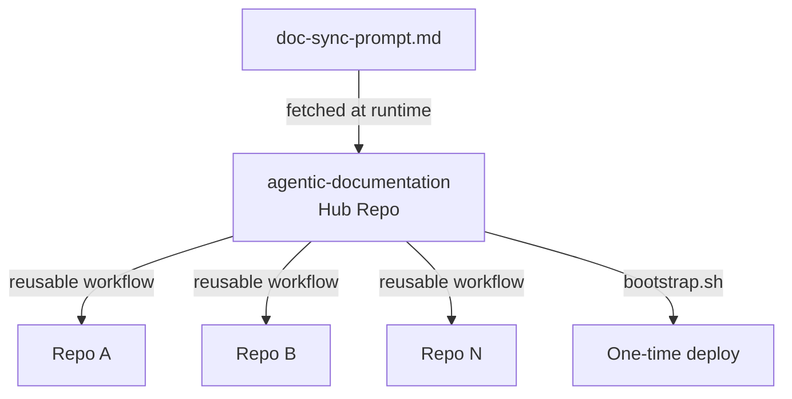

# Architecture

## Hub-and-Spoke Overview

The `agentic-documentation` repository acts as a central hub, while every DefaceRoot application repository is a spoke that calls the hub's reusable workflow. Spokes keep only a minimal caller workflow; all orchestration logic, prompt policy, and automation behavior are defined once in the hub and reused organization-wide.

## Key Files and Responsibilities

| File | Role |
|------|------|
| `.github/workflows/doc-sync-opencode.yml` | Reusable workflow that installs `opencode`, runs doc-sync commands, updates `.github/docs-last-updated-sha`, and opens a PR with documentation changes. |
| `.github/workflows/doc-sync-prompt.md` | Canonical prompt that defines synchronization policy, required docs structure, guardrails, and update behavior. |
| `templates/caller/doc-sync-caller.yml` | Minimal caller workflow stamped into target repositories; delegates execution to the hub workflow on `push`, `pull_request`, and `workflow_dispatch`. |
| `scripts/bootstrap.sh` | Organization rollout tool that dry-runs or deploys caller workflows to DefaceRoot repositories and opens PRs automatically. |

## ADR-001: Why `opencode` Instead of `gh-aw`

- **Status:** Accepted
- **Context:** The doc-sync system must work with Z.AI's OpenAI-compatible endpoint and the `glm-5` model.
- **Decision:** Use `opencode` as the runtime CLI because it can be driven through OpenAI-compatible environment variables (`OPENAI_API_KEY`, `OPENAI_BASE_URL`) and model selection.
- **Consequences:**
  - Direct compatibility with Z.AI provider conventions.
  - Provider/model changes stay centralized in workflow inputs.
  - Operational path is simplified to one agentic CLI instead of a custom per-repo agent implementation.

## ADR-002: Why Reusable Workflow Pattern

- **Status:** Accepted
- **Context:** Maintaining duplicated workflow logic across many repositories creates drift and expensive updates.
- **Decision:** Implement doc-sync in one reusable workflow (`doc-sync-opencode.yml`) that all spoke repos call.
- **Consequences:**
  - Single source of truth for behavior, prompt wiring, and PR logic.
  - Spoke repos keep a tiny caller file and inherit improvements automatically.
  - Workflow evolution only requires hub updates plus bootstrap refresh when interface changes.
