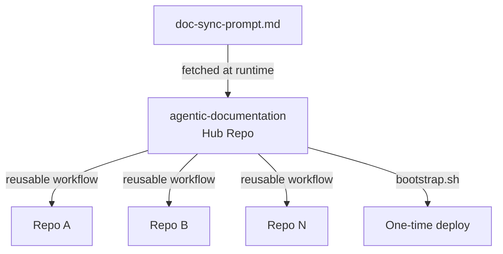

# Architecture

## Hub-and-Spoke Overview

The `agentic-documentation` repository acts as a central hub, while every DefaceRoot application repository is a spoke that calls the hub's reusable workflow. Spokes keep only a minimal caller workflow; all orchestration logic, prompt policy, and automation behavior are defined once in the hub and reused organization-wide.



## Layer Diagram

```
+------------------------------------------+
|            Trigger Layer                  |
|  push | pull_request | workflow_dispatch |
+------------------------------------------+
              |
              v
+------------------------------------------+
|         Caller Workflow (spoke)           |
|  .github/workflows/doc-sync.yml           |
+------------------------------------------+
              |
              v
+------------------------------------------+
|        Hub Reusable Workflow              |
|  doc-sync-opencode.yml                    |
|  - Install opencode CLI                   |
|  - Fetch prompt from hub                  |
|  - Configure Z.AI provider                |
+------------------------------------------+
              |
              v
+------------------------------------------+
|          Agent Execution                  |
|  opencode run --model zai/glm-5           |
|  - Analyze codebase                       |
|  - Generate/update docs                   |
+------------------------------------------+
              |
              v
+------------------------------------------+
|           Output Layer                    |
|  - docs/ changes                          |
|  - .github/docs-last-updated-sha          |
|  - Pull Request creation                  |
+------------------------------------------+
```

## Module Table

| Module | Purpose | Key Dependencies |
|--------|---------|------------------|
| `doc-sync-opencode.yml` | Reusable workflow that orchestrates doc sync | `opencode`, `peter-evans/create-pull-request` |
| `doc-sync-prompt.md` | Agent instructions for documentation maintenance | N/A (fetched at runtime) |
| `doc-sync-caller.yml` | Minimal caller template stamped into spoke repos | Hub workflow |
| `bootstrap.sh` | Organization-wide rollout deployment script | `gh` CLI, `git` |
| `opencode.json` | Z.AI custom provider configuration | `opencode` CLI |

## Data Flow: Primary Happy Path

1. **Trigger**: Developer pushes to `main`/`master` or triggers `workflow_dispatch` in a spoke repo.
2. **Caller Invocation**: The spoke's `doc-sync.yml` calls the hub's `doc-sync-opencode.yml`.
3. **Setup**: Hub workflow installs `opencode`, configures Z.AI provider via `opencode.json`.
4. **Prompt Fetch**: Workflow fetches `doc-sync-prompt.md` from hub repo (or uses local copy if on hub).
5. **Agent Execution**: `opencode run` with the prompt analyzes the codebase and generates doc updates.
6. **SHA Update**: `.github/docs-last-updated-sha` is written with current commit SHA.
7. **PR Creation**: If docs changed, a PR is opened with `docs/**` and the SHA file.

## Architecture Decision Records (ADRs)

### ADR-001: Why `opencode` Instead of `gh-aw`

- **Status:** Accepted
- **Context:** The doc-sync system must work with Z.AI's OpenAI-compatible endpoint and the `glm-5` model.
- **Decision:** Use `opencode` as the runtime CLI because it can be driven through OpenAI-compatible environment variables (`OPENAI_API_KEY`, `OPENAI_BASE_URL`) and model selection.
- **Consequences:**
  - Direct compatibility with Z.AI provider conventions.
  - Provider/model changes stay centralized in workflow inputs.
  - Operational path is simplified to one agentic CLI instead of a custom per-repo agent implementation.

### ADR-002: Why Reusable Workflow Pattern

- **Status:** Accepted
- **Context:** Maintaining duplicated workflow logic across many repositories creates drift and expensive updates.
- **Decision:** Implement doc-sync in one reusable workflow (`doc-sync-opencode.yml`) that all spoke repos call.
- **Consequences:**
  - Single source of truth for behavior, prompt wiring, and PR logic.
  - Spoke repos keep a tiny caller file and inherit improvements automatically.
  - Workflow evolution only requires hub updates plus bootstrap refresh when interface changes.

### ADR-003: Commit-Count Skip Logic

- **Status:** Accepted
- **Context:** Running doc-sync on every push is wasteful when changes are minor.
- **Decision:** Skip doc-sync unless 10+ commits have accrued, or event is `pull_request`/`workflow_dispatch`.
- **Consequences:**
  - Reduced API costs and CI minutes.
  - Docs stay reasonably fresh (max 10 commits behind).
  - Force-run available via `workflow_dispatch` for urgent updates.

### ADR-004: SHA-Based Change Tracking

- **Status:** Accepted
- **Context:** Need a lightweight way to track when docs were last synced.
- **Decision:** Store the last-synced SHA in `.github/docs-last-updated-sha`.
- **Consequences:**
  - Simple commit count calculation via `git rev-list --count`.
  - File included in PR for audit trail.
  - Missing file triggers force-run (new repos bootstrap correctly).
