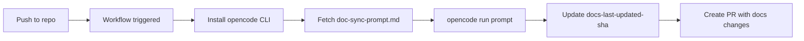

# Deployment

## Environment Variables and Secrets

| Variable | Type | Required | Description | Default |
|----------|------|----------|-------------|---------|
| `OPENCODE_API_KEY` | secret | Yes | Z.AI API key | — |
| `GH_AW_AGENT_TOKEN` | secret | Yes | GitHub PAT (`contents:write`, `pull-requests:write`) | — |
| `OPENCODE_ENDPOINT` | input | Yes | API base URL | `https://api.z.ai/api/coding/paas/v4` |
| `OPENCODE_MODEL` | input | Yes | Model name | `glm-5` |

## CI/CD Flow



## Deploy to All DefaceRoot Repositories (Bootstrap)

1. Ensure GitHub CLI is authenticated with access to DefaceRoot repositories.
2. From the hub repo root, run dry-run first:
   ```bash
   ./scripts/bootstrap.sh
   ```
3. Review the planned repo list and skips.
4. Execute rollout:
   ```bash
   ./scripts/bootstrap.sh --deploy
   ```
5. Confirm bootstrap opened PRs in each target repository.

## Deploy to One New Repository

Copy `templates/caller/doc-sync-caller.yml` into the target repository at:

```text
.github/workflows/doc-sync.yml
```

Then add `OPENCODE_API_KEY` and `GH_AW_AGENT_TOKEN` secrets and trigger `workflow_dispatch` once to validate setup.
