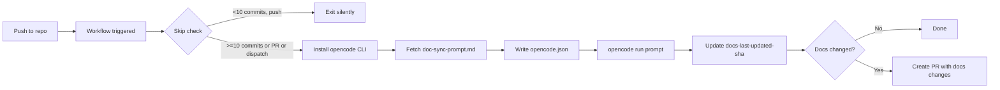

# Deployment

## Supported Environments

| Environment | Description |
|-------------|-------------|
| Local | Developer machine testing |
| Spoke Repository | Any DefaceRoot repo using the caller workflow |
| Hub Repository | `DefaceRoot/agentic-documentation` (this repo) |

## Environment Variables and Secrets

| Variable | Type | Required | Description | Default |
|----------|------|----------|-------------|---------|
| `OPENCODE_API_KEY` | secret | Yes | Z.AI API key | — |
| `GH_AW_AGENT_TOKEN` | secret | Yes | GitHub PAT for commits/PRs | — |
| `OPENCODE_ENDPOINT` | input | Yes | API base URL | `https://api.z.ai/api/coding/paas/v4` |
| `OPENCODE_MODEL` | input | Yes | Model name | `glm-5` |
| `GITHUB_TOKEN` | auto | Yes | Workflow token (provided by Actions) | — |

### Secret Scopes

| Secret | Recommended Scope |
|--------|-------------------|
| `OPENCODE_API_KEY` | Organization-level (shared) |
| `GH_AW_AGENT_TOKEN` | Organization-level (shared) |

## CI/CD Flow



## Deploy to All DefaceRoot Repositories (Bootstrap)

### Prerequisites

1. GitHub CLI installed and authenticated:
   ```bash
   gh auth status
   ```

2. `GH_AW_AGENT_TOKEN` set as org-level secret in DefaceRoot.

### Rollout Steps

1. From the hub repo root, run dry-run first:
   ```bash
   ./scripts/bootstrap.sh
   ```

2. Review the planned repo list and skips.

3. Execute rollout:
   ```bash
   ./scripts/bootstrap.sh --deploy
   ```

4. Confirm bootstrap opened PRs in each target repository.

## Deploy to One New Repository

### Manual Deployment

1. Copy `templates/caller/doc-sync-caller.yml` into the target repository at:
   ```text
   .github/workflows/doc-sync.yml
   ```

2. Add secrets to the target repository (or ensure org-level secrets are accessible):
   - `OPENCODE_API_KEY`
   - `GH_AW_AGENT_TOKEN`

3. Trigger `workflow_dispatch` once to validate setup:
   ```bash
   gh workflow run doc-sync --repo <target-repo>
   ```

### Via Bootstrap

```bash
# Bootstrap skips repos that already have the caller
./scripts/bootstrap.sh --deploy
```

## Rollback Procedure

If a doc-sync PR causes issues:

1. **Close the PR** without merging.
2. **Revert the commit** if already merged:
   ```bash
   git revert <commit-sha>
   git push
   ```
3. **Fix the prompt** if the issue is in doc generation logic:
   - Edit `.github/workflows/doc-sync-prompt.md`
   - Merge fix to `main`
4. **Re-trigger** via `workflow_dispatch` after fix.

## Health Checks

The doc-sync workflow does not expose HTTP endpoints. Health is verified via:

| Check | Method |
|-------|--------|
| Workflow success | GitHub Actions run status |
| Docs up-to-date | Compare `docs-last-updated-sha` with HEAD |
| PR created | Check for open `docs/opencode-sync` PR |
