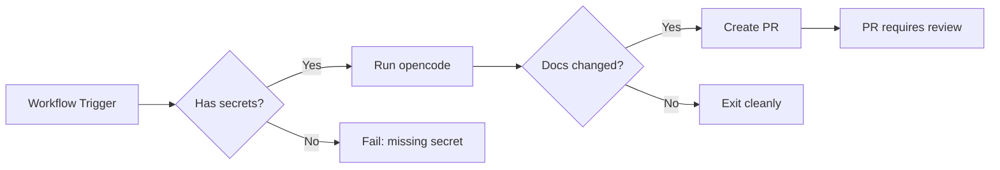

# Security

## Authentication and Authorization

### API Authentication

The doc-sync workflow authenticates with Z.AI using an API key:

| Component | Auth Method |
|-----------|-------------|
| Z.AI API | `OPENCODE_API_KEY` (OpenAI-compatible) |
| GitHub (commits/PRs) | `GH_AW_AGENT_TOKEN` (GitHub PAT) |
| GitHub (workflow) | `GITHUB_TOKEN` (automatic) |

### Authorization Model

## Secrets Inventory

| Secret | Storage | Purpose | Rotation Policy |
|--------|---------|---------|-----------------|
| `OPENCODE_API_KEY` | GitHub Secrets | Z.AI API authentication | Rotate on exposure or quarterly |
| `GH_AW_AGENT_TOKEN` | GitHub Secrets | Commit/PR creation | Rotate on exposure or quarterly |
| `GITHUB_TOKEN` | Auto-generated | Workflow execution | Auto-rotated per run |

### Minimum `GH_AW_AGENT_TOKEN` Scopes

| Scope | Required |
|-------|----------|
| `contents: write` | Yes |
| `pull-requests: write` | Yes |
| `metadata: read` | Yes |

### Secret Storage Locations

Store secrets at either:
- **Repository level** for isolated control, or
- **Organization level** for centralized management across DefaceRoot repos.

## Threat Surface Summary

| Threat Vector | Mitigation |
|---------------|------------|
| Prompt injection | Prompt is fetched from trusted hub repo; protect `main` branch |
| Secret exposure | Secrets are masked in logs; never committed to code |
| Unauthorized PRs | `GH_AW_AGENT_TOKEN` has limited scopes; PRs only affect `docs/**` |
| Malicious doc content | Agent constrained to doc updates; cannot modify workflows |
| Supply chain (prompt) | Prompt is version-controlled; changes require PR review |

### Guardrails

- The automation PR is constrained to documentation outputs (`docs/**`) plus `.github/docs-last-updated-sha`.
- It cannot modify workflow files as part of its documented change set.
- It cannot run arbitrary code beyond the centrally managed prompt-driven doc-sync execution path.
- Branch protection on `main` requires review before merging doc-sync PRs.

## Prompt Supply Chain Security

The doc-sync prompt is fetched from the hub repo `main` branch. Protect `main` with:

| Protection | Recommended |
|------------|-------------|
| Required reviewers | 1+ |
| Status checks | Pass |
| Restricted pushes | To admins/maintainers |
| Require signed commits | Optional |

This reduces prompt tampering risk.

## Dependency Vulnerability Scanning

| Tool | Cadence | Fix SLA |
|------|---------|---------|
| GitHub Dependabot | Weekly | Critical: 7 days, High: 14 days |
| `gh aw` (if used) | Per-run | Immediate for critical |

## Security Disclosure Process

### Reporting a Vulnerability

1. **Do NOT** open a public issue for security vulnerabilities.
2. Email security reports to the DefaceRoot security team (or use GitHub Security Advisories).
3. Include:
   - Description of the vulnerability
   - Steps to reproduce
   - Potential impact
   - Suggested fix (if any)

### Response Timeline

| Stage | Target |
|-------|--------|
| Acknowledgment | 48 hours |
| Initial assessment | 7 days |
| Fix development | 14-30 days (severity dependent) |
| Disclosure | After fix is released |

## Secret Hygiene

- Never commit actual secret values to source control, PR descriptions, logs, or issue comments.
- Rotate secrets from **GitHub Settings → Secrets and variables → Actions** on a defined cadence or immediately after suspected exposure.
- Use `secrets: inherit` in caller workflows to avoid hardcoding secret names.
